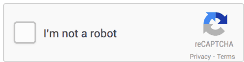

# WhoUR

 </img>

	
	<a href="https://git.nixnet.services/pluja/awesome-privacy"></img></a>

List of free, open source and privacy respecting services and alternatives to privative services.

	<a href="https://github.com/pluja/awesome-privacy/blob/main/misc/ABOUT.md"> About </a> | 
	<a href="https://github.com/pluja/awesome-privacy/blob/main/misc/Contributing.md"> Contributing </a> | 
	<a href="https://github.com/pluja/awesome-privacy/blob/main/misc/QUOTES.md"> Quotes </a> | 
	<a href="https://github.com/pluja/awesome-privacy/discussions"> Discussions </a>

--------------------------------------------------------------------------------------------

## Contents
- [2FA](#2fa)
- [Analytics](#analytics)
- [Android App Store](#android-app-store)
- [Android Dialer](#android-dialer)
- [Android File Manager](#android-file-manager)
- [Android Keyboard](#android-keyboard)
- [Android Launcher](#android-launcher)
- [Bookmarking](#bookmarking)
- [Captchas](#captchas)
- [Cloaking](#cloaking)
- [Cloud Storage](#cloud-storage)
- [Databases](#databases)
- [Dating Apps](#dating-apps)
- [Developer Tools](#developer-tools)
    - [IDEs](#ides)
- [Domain Registrar](#domain-registrar)
- [Download Manager](#download-manager)
- [Encryption](#encryption)
- [File Management and Sharing](#file-management-and-sharing)
- [Fitness and Health](#fitness-and-health)
- [Fonts](#fonts)
- [Forms](#forms)
- [Games](#games)
    - [Mario Kart](#mario-kart)
    - [Minecraft](#minecraft)
    - [Sonic the Hedgehog](#sonic-the-hedgehog)
- [Home Assistants](#home-assistants)
- [Instant Messaging](#instant-messaging)
- [Link Shorteners](#link-shorteners)
- [Location tracking](#location-tracking)
- [Mail Services](#mail-services)
- [Maps and Navigation](#maps-and-navigation)
- [Media Streaming Platforms](#media-streaming-platforms)
    - [Video and Audio](#video-and-audio)
    - [Audio](#audio)
    - [Podcasts](#podcasts)
- [Music Recognition (Shazam-like)](#music-recognition)
- [Notes and Tasks](#notes-and-tasks)
- [Office](#office)
- [Online Phone Providers (SMS)](#online-phone-providers)
- [Operating Systems](#operating-systems)
    - [Android](#android)
    - [PC / MacOS](#pc--macos)
    - [Smart TV](#smart-tv)
- [Password Managers](#password-managers)
- [Pastebin and Secret Sharing](#pastebin-and-secret-sharing)
- [Payments](#payments)
- [Personal Finances](#personal-finances)
- [Photo Editing and Management](#photo-editing-and-management)
- [Photo Storage](#photo-storage)
- [Privacy Tools](#privacy-tools)
- [Remote Access and Control](#remote-access-and-control)
- [Search Engines](#search-engines)
- [Social Networks and Platforms](#social-networks-and-platforms)
    - [Blogging platforms (Medium / Blogger)](#blogging-platforms-medium)
    - [Imgur](#imgur)
    - [Instagram](#instagram)
    - [Quora](#quora)
    - [LBRY and Odysee](#lbry-and-odysee)
    - [Reddit](#reddit)
    - [Streaming Platforms (Twitch)](#streaming-platforms-twitch)
    - [TikTok](#tiktok)
    - [Twitter](#twitter)
    - [Wikipedia](#wikipedia)
    - [YouTube](#youtube)
- [Teamworking Tools](#teamworking-tools)
- [Translation and Speech-to-Text](#translation-and-speech-to-text)
- [Uncategorized](#uncategorized)
- [Utilities](#utilities)
- [Video and Audio Conferencing](#video-and-audio-conferencing)
- [Video Editing](#video-editing)
- [Virtual Private Networks (VPNs)](#VPNs)
- [Web Browser](#web-browser)
    - [Browser Addons](#browser-addons) 
    - [Browser Sync](#browser-sync)
    - [WebView](#webview)
